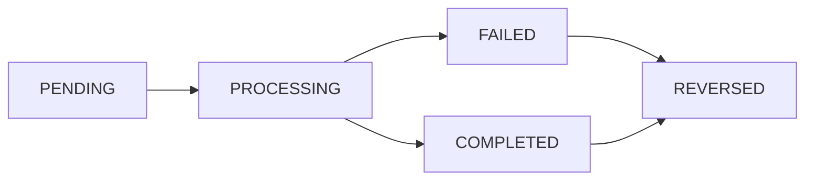

# Account Management in Banking Systems

Welcome to the heart of banking technology! This guide will help you understand how Rails manages bank accounts, processes transactions, and maintains balances using Rust programming language.

## What is Account Management in Banking?

Think of account management like a **digital vault system**:

<Tabs>
  <Tab title="Physical Bank Vault">
    - **Safety Deposit Boxes**: Each customer has their own secure box
    - **Vault Keeper**: Tracks who owns which box and what's inside
    - **Access Control**: Only authorized people can open boxes
    - **Transaction Log**: Records every time someone accesses their box
  </Tab>
  
  <Tab title="Digital Banking (Rails)">
    - **Bank Accounts**: Each customer has checking/savings accounts
    - **Account Service**: Tracks balances, transactions, and ownership
    - **Access Control**: APIs ensure only authorized access to accounts
    - **Transaction History**: Every money movement is permanently recorded
  </Tab>
</Tabs>

**Account Management = Safely storing money, tracking balances, and processing transactions at lightning speed.**

## Why Rust for Account Management?

### ⚡ Speed Matters in Banking
- **Milliseconds count**: Faster transactions = happier customers
- **High throughput**: Process thousands of transactions per second
- **Real-time balances**: Instant updates when money moves
- **Concurrent processing**: Handle many operations simultaneously

### 🛡️ Safety is Critical
- **Memory safety**: Prevents crashes that could lose money
- **Thread safety**: Multiple operations won't interfere with each other
- **Zero-cost abstractions**: Fast code without sacrificing safety
- **Compile-time checks**: Catch errors before they reach production

### 🏦 Perfect for Banking Because
- **No garbage collection pauses**: Consistent performance under load
- **Predictable performance**: No surprise slowdowns during peak hours
- **Resource efficient**: Uses less memory and CPU than other languages
- **Reliability**: Systems stay up 24/7 without crashes

<Note>
**For Beginners**: Rust might look complex at first, but it prevents the kinds of bugs that cost banks millions of dollars. The extra safety is worth learning!
</Note>

## Core Account Management Components

### 1. Account Model (The Digital Bank Account)

```rust rails/mvp/api/accounts/src/models/account.rs#L1-45
use sqlx::FromRow;
use serde::{Deserialize, Serialize};
use chrono::{DateTime, Utc};
use rust_decimal::Decimal;

#[derive(Debug, Clone, Serialize, Deserialize, FromRow)]
pub struct Account {
    pub id: i64,
    pub user_id: i64,
    pub organization_id: i64,
    pub account_type: AccountType,
    pub account_number: String,
    pub balance: Decimal,           // Using Decimal for precise money calculations
    pub currency: String,           // USD, EUR, GBP, etc.
    pub status: AccountStatus,
    pub environment: Environment,   // SANDBOX, PRODUCTION
    pub metadata: Option<serde_json::Value>, // Additional account data as JSON
    pub created_at: DateTime<Utc>,
    pub updated_at: DateTime<Utc>,
}

#[derive(Debug, Clone, Serialize, Deserialize, sqlx::Type)]
#[sqlx(type_name = "account_type", rename_all = "SCREAMING_SNAKE_CASE")]
pub enum AccountType {
    Checking,
    Savings,
    Investment,
    Credit,
}

#[derive(Debug, Clone, Serialize, Deserialize, sqlx::Type)]
#[sqlx(type_name = "account_status", rename_all = "SCREAMING_SNAKE_CASE")]
pub enum AccountStatus {
    Active,
    Suspended,
    Closed,
    Pending,
}

#[derive(Debug, Clone, Serialize, Deserialize, sqlx::Type)]
#[sqlx(type_name = "environment", rename_all = "SCREAMING_SNAKE_CASE")]
pub enum Environment {
    Sandbox,
    Production,
}
```

**What this means in simple terms:**
- **Decimal for money**: Never loses precision (no $0.01 rounding errors)
- **Enums for types**: Only valid account types can be used
- **DateTime<Utc>**: All timestamps use coordinated universal time
- **Metadata as JSON**: Flexible storage for additional account features

### 2. Account Repository (Database Access Layer)

```rust rails/mvp/api/accounts/src/repositories/account_repository.rs#L1-80
use sqlx::{PgPool, Result, Row};
use rust_decimal::Decimal;
use crate::models::account::{Account, AccountType, AccountStatus};
use crate::errors::AppError;

pub struct AccountRepository {
    pool: PgPool,
}

impl AccountRepository {
    pub fn new(pool: PgPool) -> Self {
        Self { pool }
    }
    
    // Create new bank account
    pub async fn create_account(&self, account: &Account) -> Result<Account, AppError> {
        let query = sqlx::query_as!(
            Account,
            r#"
            INSERT INTO accounts (user_id, organization_id, account_type, account_number, 
                                balance, currency, status, environment, metadata)
            VALUES ($1, $2, $3, $4, $5, $6, $7, $8, $9)
            RETURNING *
            "#,
            account.user_id,
            account.organization_id,
            account.account_type as _,
            account.account_number,
            account.balance,
            account.currency,
            account.status as _,
            account.environment as _,
            account.metadata
        );
        
        query.fetch_one(&self.pool)
            .await
            .map_err(|e| AppError::Database(e.to_string()))
    }
    
    // Get account by ID with balance
    pub async fn get_by_id(&self, account_id: i64) -> Result<Option<Account>, AppError> {
        let query = sqlx::query_as!(
            Account,
            "SELECT * FROM accounts WHERE id = $1 AND status != 'CLOSED'",
            account_id
        );
        
        query.fetch_optional(&self.pool)
            .await
            .map_err(|e| AppError::Database(e.to_string()))
    }
    
    // Update account balance atomically
    pub async fn update_balance(&self, account_id: i64, new_balance: Decimal) -> Result<(), AppError> {
        let result = sqlx::query!(
            "UPDATE accounts SET balance = $1, updated_at = NOW() WHERE id = $2",
            new_balance,
            account_id
        );
        
        result.execute(&self.pool)
            .await
            .map_err(|e| AppError::Database(e.to_string()))?;
            
        Ok(())
    }
    
    // Get all accounts for a user
    pub async fn get_by_user_id(&self, user_id: i64) -> Result<Vec<Account>, AppError> {
        let query = sqlx::query_as!(
            Account,
            "SELECT * FROM accounts WHERE user_id = $1 AND status = 'ACTIVE' ORDER BY created_at",
            user_id
        );
        
        query.fetch_all(&self.pool)
            .await
            .map_err(|e| AppError::Database(e.to_string()))
    }
    
    // Check if account has sufficient funds
    pub async fn has_sufficient_funds(&self, account_id: i64, amount: Decimal) -> Result<bool, AppError> {
        let row = sqlx::query!(
            "SELECT balance FROM accounts WHERE id = $1",
            account_id
        )
        .fetch_one(&self.pool)
        .await
        .map_err(|e| AppError::Database(e.to_string()))?;
        
        Ok(row.balance >= amount)
    }
}
```

**Why this approach is powerful:**
- **Compile-time SQL checking**: SQLx validates queries at compile time
- **Type safety**: Can't accidentally use wrong data types
- **Async/await**: Non-blocking operations for high performance
- **Connection pooling**: Efficiently manages database connections

### 3. Account Service (Business Logic)

```rust rails/mvp/api/accounts/src/services/account_service.rs#L1-120
use sqlx::PgPool;
use rust_decimal::Decimal;
use uuid::Uuid;
use crate::models::account::{Account, AccountType, AccountStatus, Environment};
use crate::repositories::account_repository::AccountRepository;
use crate::services::transaction_service::TransactionService;
use crate::errors::AppError;

pub struct AccountService {
    account_repo: AccountRepository,
    transaction_service: TransactionService,
}

impl AccountService {
    pub fn new(pool: PgPool) -> Self {
        Self {
            account_repo: AccountRepository::new(pool.clone()),
            transaction_service: TransactionService::new(pool),
        }
    }
    
    // Create new account with validation
    pub async fn create_account(
        &self, 
        user_id: i64, 
        organization_id: i64,
        account_type: AccountType,
        currency: String,
        environment: Environment,
        initial_deposit: Option<Decimal>
    ) -> Result<Account, AppError> {
        
        // Generate unique account number
        let account_number = self.generate_account_number(&account_type).await?;
        
        // Validate initial deposit
        let balance = initial_deposit.unwrap_or(Decimal::ZERO);
        if balance < Decimal::ZERO {
            return Err(AppError::InvalidAmount("Initial deposit cannot be negative".to_string()));
        }
        
        let account = Account {
            id: 0, // Will be set by database
            user_id,
            organization_id,
            account_type: account_type.clone(),
            account_number: account_number.clone(),
            balance,
            currency: currency.clone(),
            status: AccountStatus::Active,
            environment,
            metadata: None,
            created_at: chrono::Utc::now(),
            updated_at: chrono::Utc::now(),
        };
        
        // Create account in database
        let created_account = self.account_repo.create_account(&account).await?;
        
        // If there's an initial deposit, record the transaction
        if let Some(deposit_amount) = initial_deposit {
            if deposit_amount > Decimal::ZERO {
                self.transaction_service.record_deposit(
                    created_account.id,
                    deposit_amount,
                    "Initial deposit".to_string()
                ).await?;
            }
        }
        
        Ok(created_account)
    }
    
    // Transfer money between accounts (atomic operation)
    pub async fn transfer_funds(
        &self,
        from_account_id: i64,
        to_account_id: i64,
        amount: Decimal,
        description: String
    ) -> Result<String, AppError> {
        
        // Validate amount
        if amount <= Decimal::ZERO {
            return Err(AppError::InvalidAmount("Transfer amount must be positive".to_string()));
        }
        
        // Begin database transaction for atomicity
        let mut tx = sqlx::begin(&self.account_repo.pool).await
            .map_err(|e| AppError::Database(e.to_string()))?;
        
        // Check source account exists and has funds
        let from_account = self.account_repo.get_by_id(from_account_id).await?
            .ok_or(AppError::AccountNotFound)?;
            
        if from_account.balance < amount {
            return Err(AppError::InsufficientFunds);
        }
        
        // Check destination account exists
        let to_account = self.account_repo.get_by_id(to_account_id).await?
            .ok_or(AppError::AccountNotFound)?;
            
        // Verify accounts are in same currency (for now)
        if from_account.currency != to_account.currency {
            return Err(AppError::CurrencyMismatch);
        }
        
        // Update balances atomically
        let new_from_balance = from_account.balance - amount;
        let new_to_balance = to_account.balance + amount;
        
        sqlx::query!(
            "UPDATE accounts SET balance = $1, updated_at = NOW() WHERE id = $2",
            new_from_balance,
            from_account_id
        ).execute(&mut *tx).await
            .map_err(|e| AppError::Database(e.to_string()))?;
            
        sqlx::query!(
            "UPDATE accounts SET balance = $1, updated_at = NOW() WHERE id = $2", 
            new_to_balance,
            to_account_id
        ).execute(&mut *tx).await
            .map_err(|e| AppError::Database(e.to_string()))?;
        
        // Generate unique transaction ID
        let transaction_id = Uuid::new_v4().to_string();
        
        // Record the transaction
        sqlx::query!(
            r#"
            INSERT INTO transactions (id, from_account_id, to_account_id, amount, 
                                    currency, description, transaction_type, status)
            VALUES ($1, $2, $3, $4, $5, $6, 'TRANSFER', 'COMPLETED')
            "#,
            transaction_id,
            from_account_id,
            to_account_id,
            amount,
            from_account.currency,
            description
        ).execute(&mut *tx).await
            .map_err(|e| AppError::Database(e.to_string()))?;
        
        // Commit the transaction
        tx.commit().await
            .map_err(|e| AppError::Database(e.to_string()))?;
        
        Ok(transaction_id)
    }
    
    // Generate unique account number
    async fn generate_account_number(&self, account_type: &AccountType) -> Result<String, AppError> {
        let prefix = match account_type {
            AccountType::Checking => "CHK",
            AccountType::Savings => "SAV", 
            AccountType::Investment => "INV",
            AccountType::Credit => "CRD",
        };
        
        let random_number = rand::random::<u32>() % 100000000; // 8 digits
        Ok(format!("{}{:08}", prefix, random_number))
    }
}
```

## Transaction Processing (How Money Moves)

### Understanding Transaction States



### Transaction Model

```rust rails/mvp/api/accounts/src/models/transaction.rs#L1-40
use sqlx::FromRow;
use serde::{Deserialize, Serialize};
use chrono::{DateTime, Utc};
use rust_decimal::Decimal;

#[derive(Debug, Clone, Serialize, Deserialize, FromRow)]
pub struct Transaction {
    pub id: String,                    // UUID for uniqueness
    pub from_account_id: Option<i64>,  // Source account (None for deposits)
    pub to_account_id: Option<i64>,    // Destination account (None for withdrawals)
    pub amount: Decimal,
    pub currency: String,
    pub transaction_type: TransactionType,
    pub status: TransactionStatus,
    pub description: String,
    pub reference_id: Option<String>,  // External reference
    pub fee_amount: Option<Decimal>,   // Transaction fees
    pub processed_at: Option<DateTime<Utc>>,
    pub created_at: DateTime<Utc>,
    pub updated_at: DateTime<Utc>,
}

#[derive(Debug, Clone, Serialize, Deserialize, sqlx::Type)]
#[sqlx(type_name = "transaction_type", rename_all = "SCREAMING_SNAKE_CASE")]
pub enum TransactionType {
    Transfer,
    Deposit,
    Withdrawal,
    Payment,
    Refund,
    Fee,
}

#[derive(Debug, Clone, Serialize, Deserialize, sqlx::Type)]
#[sqlx(type_name = "transaction_status", rename_all = "SCREAMING_SNAKE_CASE")]
pub enum TransactionStatus {
    Pending,
    Processing, 
    Completed,
    Failed,
    Cancelled,
    Reversed,
}
```

## Real-World Example: Mobile Payment

Let's trace what happens when you send money to a friend through a banking app:

<Steps>
  <Step title="User initiates transfer in mobile app">
    ```json
    POST /api/accounts/transfer
    {
      "from_account": "CHK12345678",
      "to_account": "SAV87654321", 
      "amount": "50.00",
      "currency": "USD",
      "description": "Birthday gift 🎂"
    }
    ```
  </Step>
  
  <Step title="Rust service validates the request">
    ```rust
    // Check accounts exist and are active
    let from_account = self.account_repo.get_by_account_number(&request.from_account).await?
        .ok_or(AppError::AccountNotFound)?;
        
    let to_account = self.account_repo.get_by_account_number(&request.to_account).await?
        .ok_or(AppError::AccountNotFound)?;
    
    // Validate sufficient funds
    if from_account.balance < request.amount {
        return Err(AppError::InsufficientFunds);
    }
    
    // Check daily transfer limits
    let daily_total = self.get_daily_transfer_total(from_account.id).await?;
    if daily_total + request.amount > from_account.daily_limit {
        return Err(AppError::DailyLimitExceeded);
    }
    ```
  </Step>
  
  <Step title="System processes transfer atomically">
    ```rust
    // Start database transaction
    let mut tx = sqlx::begin(&self.pool).await?;
    
    // Update sender's balance
    sqlx::query!(
        "UPDATE accounts SET balance = balance - $1 WHERE id = $2",
        request.amount,
        from_account.id
    ).execute(&mut *tx).await?;
    
    // Update receiver's balance  
    sqlx::query!(
        "UPDATE accounts SET balance = balance + $1 WHERE id = $2",
        request.amount, 
        to_account.id
    ).execute(&mut *tx).await?;
    
    // Record transaction
    sqlx::query!(
        "INSERT INTO transactions (...) VALUES (...)",
        // transaction details
    ).execute(&mut *tx).await?;
    
    // Commit all changes
    tx.commit().await?;
    ```
  </Step>
  
  <Step title="Both users receive real-time notifications">
    ```rust
    // Publish events for real-time updates
    let sender_event = AccountBalanceUpdated {
        account_id: from_account.id,
        new_balance: from_account.balance - request.amount,
        transaction_id: transaction_id.clone(),
    };
    
    let receiver_event = AccountBalanceUpdated {
        account_id: to_account.id,
        new_balance: to_account.balance + request.amount,
        transaction_id: transaction_id.clone(),
    };
    
    self.event_publisher.publish(sender_event).await?;
    self.event_publisher.publish(receiver_event).await?;
    ```
  </Step>
</Steps>

## Advanced Account Features

### 1. Recurring Payments (Automatic Transfers)

```rust rails/mvp/api/accounts/src/models/recurring_payment.rs#L1-35
#[derive(Debug, Clone, Serialize, Deserialize, FromRow)]
pub struct RecurringPayment {
    pub id: i64,
    pub from_account_id: i64,
    pub to_account_id: Option<i64>,    // None for external payments
    pub amount: Decimal,
    pub currency: String,
    pub frequency: PaymentFrequency,    // DAILY, WEEKLY, MONTHLY, etc.
    pub start_date: DateTime<Utc>,
    pub end_date: Option<DateTime<Utc>>,
    pub next_payment_date: DateTime<Utc>,
    pub description: String,
    pub status: RecurringPaymentStatus,
    pub created_at: DateTime<Utc>,
    pub updated_at: DateTime<Utc>,
}

#[derive(Debug, Clone, Serialize, Deserialize, sqlx::Type)]
#[sqlx(type_name = "payment_frequency", rename_all = "SCREAMING_SNAKE_CASE")]
pub enum PaymentFrequency {
    Daily,
    Weekly,
    BiWeekly,
    Monthly,
    Quarterly,
    Annually,
}

#[derive(Debug, Clone, Serialize, Deserialize, sqlx::Type)]
#[sqlx(type_name = "recurring_payment_status", rename_all = "SCREAMING_SNAKE_CASE")]
pub enum RecurringPaymentStatus {
    Active,
    Paused,
    Cancelled,
    Completed,
}
```

**Real-world use cases:**
- **Rent payments**: Automatic monthly transfers to landlord
- **Savings goals**: Weekly transfers to savings account
- **Bill payments**: Monthly utility and subscription payments
- **Investment contributions**: Regular transfers to investment accounts

### 2. Fixed Savings Plans (Goal-Based Saving)

```rust rails/mvp/api/accounts/src/models/fixed_savings_plan.rs#L1-40
#[derive(Debug, Clone, Serialize, Deserialize, FromRow)]
pub struct FixedSavingsPlan {
    pub id: i64,
    pub account_id: i64,
    pub plan_name: String,
    pub target_amount: Decimal,
    pub current_amount: Decimal,
    pub monthly_contribution: Decimal,
    pub plan_type: SavingsPlanType,
    pub maturity_date: Option<DateTime<Utc>>,
    pub interest_rate: Option<Decimal>,
    pub status: SavingsPlanStatus,
    pub created_at: DateTime<Utc>,
    pub updated_at: DateTime<Utc>,
}

#[derive(Debug, Clone, Serialize, Deserialize, sqlx::Type)]
#[sqlx(type_name = "savings_plan_type", rename_all = "SCREAMING_SNAKE_CASE")]
pub enum SavingsPlanType {
    AutoWithdraw,   // Saves amount, withdraws monthly
    DateLocked,     // Saves amount, accessible only on specific date
    GoalBased,      // Saves until target amount reached
    FlexibleSavings, // Can withdraw anytime
}

#[derive(Debug, Clone, Serialize, Deserialize, sqlx::Type)]
#[sqlx(type_name = "savings_plan_status", rename_all = "SCREAMING_SNAKE_CASE")]
pub enum SavingsPlanStatus {
    Active,
    Paused,
    Matured,
    Cancelled,
}
```

**Savings plan examples:**
- **Emergency fund**: Save $10,000 for emergencies
- **Vacation savings**: Save $3,000 for summer vacation
- **Home down payment**: Save $50,000 for house purchase
- **Education fund**: Save for children's college expenses

## High-Performance Patterns in Rust

### 1. Connection Pooling

```rust rails/mvp/api/accounts/src/config/database.rs#L1-30
use sqlx::{PgPool, postgres::PgPoolOptions};
use std::time::Duration;

pub async fn create_database_pool(database_url: &str) -> Result<PgPool, sqlx::Error> {
    PgPoolOptions::new()
        .max_connections(50)                    // Maximum connections
        .min_connections(10)                    // Always keep minimum open
        .connect_timeout(Duration::from_secs(30))  // Connection timeout
        .idle_timeout(Duration::from_secs(600))    // Close idle connections
        .max_lifetime(Duration::from_secs(1800))   // Connection max lifetime
        .connect(database_url)
        .await
}

// Usage in main application
#[tokio::main]
async fn main() -> Result<(), Box<dyn std::error::Error>> {
    let database_url = std::env::var("DATABASE_URL")?;
    let pool = create_database_pool(&database_url).await?;
    
    // Pool is shared across all requests
    let account_service = AccountService::new(pool.clone());
    
    // Start web server
    start_server(account_service).await
}
```

### 2. Concurrent Transaction Processing

```rust rails/mvp/api/accounts/src/services/batch_processor.rs#L1-50
use tokio::sync::Semaphore;
use futures::future::try_join_all;
use std::sync::Arc;

pub struct BatchTransactionProcessor {
    account_service: Arc<AccountService>,
    concurrency_limit: Arc<Semaphore>,
}

impl BatchTransactionProcessor {
    pub fn new(account_service: AccountService, max_concurrent: usize) -> Self {
        Self {
            account_service: Arc::new(account_service),
            concurrency_limit: Arc::new(Semaphore::new(max_concurrent)),
        }
    }
    
    // Process multiple transactions concurrently
    pub async fn process_batch(&self, transactions: Vec<TransferRequest>) -> Result<Vec<String>, AppError> {
        let tasks: Vec<_> = transactions.into_iter().map(|transfer_request| {
            let account_service = Arc::clone(&self.account_service);
            let semaphore = Arc::clone(&self.concurrency_limit);
            
            tokio::spawn(async move {
                // Acquire semaphore permit (limits concurrency)
                let _permit = semaphore.acquire().await.unwrap();
                
                // Process single transaction
                account_service.transfer_funds(
                    transfer_request.from_account_id,
                    transfer_request.to_account_id,
                    transfer_request.amount,
                    transfer_request.description
                ).await
            })
        }).collect();
        
        // Wait for all tasks to complete
        let results: Result<Vec<_>, _> = try_join_all(tasks).await;
        
        match results {
            Ok(transaction_ids) => {
                let mut successful_ids = Vec::new();
                for result in transaction_ids {
                    match result {
                        Ok(id) => successful_ids.push(id),
                        Err(e) => return Err(e),
                    }
                }
                Ok(successful_ids)
            }
            Err(e) => Err(AppError::Concurrent(e.to_string()))
        }
    }
}
```

## REST API Endpoints

### Account Management API

```rust rails/mvp/api/accounts/src/handlers/accounts.rs#L1-80
use axum::{
    extract::{Path, Query, State},
    http::StatusCode,
    response::Json,
    Extension,
};
use serde::{Deserialize, Serialize};
use crate::services::account_service::AccountService;
use crate::models::account::{Account, AccountType, Environment};

#[derive(Deserialize)]
pub struct CreateAccountRequest {
    pub account_type: AccountType,
    pub currency: String,
    pub initial_deposit: Option<rust_decimal::Decimal>,
}

#[derive(Serialize)]
pub struct AccountResponse {
    pub id: i64,
    pub account_number: String,
    pub account_type: AccountType,
    pub balance: rust_decimal::Decimal,
    pub currency: String,
    pub status: String,
    pub created_at: String,
}

impl From<Account> for AccountResponse {
    fn from(account: Account) -> Self {
        Self {
            id: account.id,
            account_number: account.account_number,
            account_type: account.account_type,
            balance: account.balance,
            currency: account.currency,
            status: format!("{:?}", account.status),
            created_at: account.created_at.to_rfc3339(),
        }
    }
}

// Create new account
pub async fn create_account(
    State(account_service): State<AccountService>,
    Extension(user_id): Extension<i64>,  // From JWT authentication
    Extension(org_id): Extension<i64>,   // From JWT authentication
    Json(request): Json<CreateAccountRequest>,
) -> Result<(StatusCode, Json<AccountResponse>), (StatusCode, Json<serde_json::Value>)> {
    
    match account_service.create_account(
        user_id,
        org_id, 
        request.account_type,
        request.currency,
        Environment::Production, // or Sandbox based on context
        request.initial_deposit
    ).await {
        Ok(account) => {
            let response = AccountResponse::from(account);
            Ok((StatusCode::CREATED, Json(response)))
        }
        Err(e) => {
            let error_response = serde_json::json!({
                "error": "Failed to create account",
                "message": e.to_string()
            });
            Err((StatusCode::BAD_REQUEST, Json(error_response)))
        }
    }
}

// Get account balance
pub async fn get_account_balance(
    State(account_service): State<AccountService>,
    Path(account_id): Path<i64>,
    Extension(user_id): Extension<i64>,
) -> Result<Json<serde_json::Value>, (StatusCode, Json<serde_json::Value>)> {
    
    match account_service.get_account_balance(account_id, user_id).await {
        Ok(account) => {
            let response = serde_json::json!({
                "account_id": account.id,
                "balance": account.balance,
                "currency": account.currency,
                "last_updated": account.updated_at.to_rfc3339()
            });
            Ok(Json(response))
        }
        Err(e) => {
            let error_response = serde_json::json!({
                "error": "Account not found or access denied",
                "message": e.to_string()
            });
            Err((StatusCode::NOT_FOUND, Json(error_response)))
        }
    }
}

// Transfer money between accounts
#[derive(Deserialize)]
pub struct TransferRequest {
    pub to_account_id: i64,
    pub amount: rust_decimal::Decimal,
    pub description: String,
}

pub async fn transfer_funds(
    State(account_service): State<AccountService>,
    Path(from_account_id): Path<i64>,
    Extension(user_id): Extension<i64>,
    Json(request): Json<TransferRequest>,
) -> Result<Json<serde_json::Value>, (StatusCode, Json<serde_json::Value>)> {
    
    // Verify user owns the source account
    match account_service.verify_account_ownership(from_account_id, user_id).await {
        Ok(false) => {
            let error_response = serde_json::json!({
                "error": "Access denied",
                "message": "You don't own this account"
            });
            return Err((StatusCode::FORBIDDEN, Json(error_response)));
        }
        Err(e) => {
            let error_response = serde_json::json!({
                "error": "Account verification failed", 
                "message": e.to_string()
            });
            return Err((StatusCode::INTERNAL_SERVER_ERROR, Json(error_response)));
        }
        Ok(true) => {} // Continue with transfer
    }
    
    match account_service.transfer_funds(
        from_account_id,
        request.to_account_id,
        request.amount,
        request.description
    
